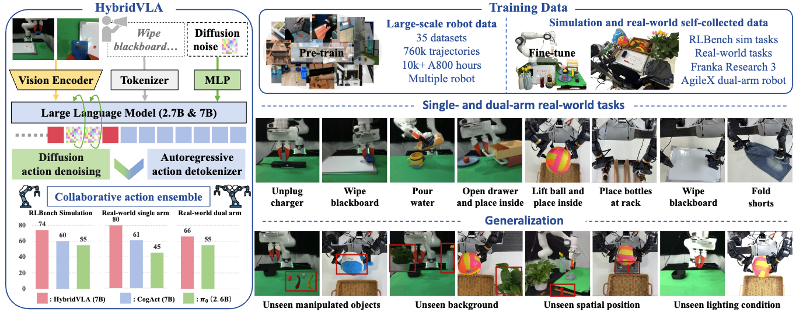

<div align="center">

# HybridVLA: Collaborative Diffusion and Autoregression in a Unified Vision-Language-Action Model


  
[🌐**Project Page**](https://hybrid-vla.github.io/) | [✍️**Paper(Arxiv)**](https://hybrid-vla.github.io/) | [🎥**Demo**](https://hybrid-vla.github.io/)


Jiaming Liu, Hao Chen, Pengju An, Zhuoyang Liu, Renrui Zhang, Chenyang Gu, Xiaoqi Li, Ziyu Guo, Sixiang Chen, 
Mengzhen Liu, Chengkai Hou, Mengdi Zhao, KC alex Zhou, Pheng-Ann Heng, Shanghang Zhang

</div>



**🤖 HybridVLA innovatively integrates diffusion and autoregressive action prediction within a single LLM, fully leveraging the continuity and probabilistic nature of diffusion alongside the reasoning capabilities of autoregressive modeling.** It undergoes pretraining on large, diverse, cross-embodied real-world robotic datasets and is further fine-tuned on both simulation and self-collected real-world data. HybridVLA achieves remarkable performance across various tasks, demonstrating strong generalization to unseen manipulated objects, backgrounds, spatial positions, and lighting conditions.

## ✨ News ✨

- [2025/03/13] HybridVLA is now live on arXiv! The pre-trained checkpoint on a large-scale robotic dataset has also been released.🚀 

## ✨ Coming soon ✨

- The training config and code will be officially released as soon as possible!


## 📦 Installation

The code is built using Python 3.10, we also recommand to use Python above Python 3.10. We require PyTorch >= 2.2.0 and CUDA >= 12.0 (It may run with lower versions, but we have not tested it).
We recommend using [Miniconda](https://docs.conda.io/en/latest/miniconda.html) and create an environment as follows:

```bash
conda create --name hybridvla python=3.10
```

Next, clone our repo and install the required packages with the following commands:

```bash
git clone https://github.com/PKU-HMI-Lab/Hybrid-VLA
cd Hybrid-VLA
pip install -e .
```

If you need to use the traning code, please also install the [Flash Attention](https://github.com/Dao-AILab/flash-attention):

```bash
# Training additionally requires Flash-Attention 2 (https://github.com/Dao-AILab/flash-attention)
pip install packaging ninja

# Verify Ninja --> should return exit code "0"
ninja --version; echo $?

# Install Flash Attention 2
# =>> If you run into difficulty, try `pip cache remove flash_attn` first
pip install "flash-attn==2.5.5" --no-build-isolation
```


## 🧩 Framework

Our code is built based on [OpenVLA](https://github.com/openvla/openvla) and [CogACT](https://github.com/microsoft/CogACT) and is organized in the following framework:

- `config`: config files for hydridvla training
- `scripts`: scripts for training
- `training`: strategies and utils for training
- `models`: models including hybridvla models and backbones

## 💡Getting Started

### Inference

Our model requires PIL image and text prompt as input, please refer to the code below for the minimal inference:

```python
from PIL import Image
from models.load import load_vla
import torch

model = load_vla(
      model_path,                 # The local path to the model checkpoint
      load_for_training=False,        
      hf_token=your_hf_token,
      use_diff=True,
    )                                 
# about 30G Memory in fp32; 

# (Optional) use "model.vlm = model.vlm.to(torch.bfloat16)" to load vlm in bf16

model.to('cuda:0').eval()

image: Image.Image = <input_your_image>     
prompt = "pick up the block"           # input your prompt

# Predict Action (7-DoF; un-normalize for RT-1 google robot data, i.e., fractal20220817_data)
actions_diff, actions_ar, _, _ = model.predict_action_diff_ar(
          image,
          prompt,
          unnorm_key='fractal20220817_data',    # input your unnorm_key of the dataset
          cfg_scale = 0.0,                   
          use_ddim = True,                   # use DDIM sampling
          num_ddim_steps = 10,               # number of steps for DDIM sampling
        )

# results in a 7-DoF diff actions of 1 steps with shape (1, 7), and a 7-DoF ar action with shape (7,)
```

## 🔍Test in RLBench

We evaluated our hybridvla in [RLBench](https://github.com/stepjam/RLBench), which based on the CoppeliaSim simulator, to build the testing environment quickly, please refer to [LIFT3D](https://github.com/PKU-HMI-Lab/LIFT3D)'s instructions to install and test in RLBench.

Please remember to set the environment variable:

```bash
export COPPELIASIM_ROOT=${HOME}/CoppeliaSim
export LD_LIBRARY_PATH=$LD_LIBRARY_PATH:$COPPELIASIM_ROOT
export QT_QPA_PLATFORM_PLUGIN_PATH=$COPPELIASIM_ROOT
```


## 📜️ License


This project is licensed under the MIT License - see the [LICENSE](LICENSE) file for details.
